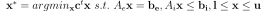
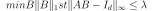

# Goal

This projet provides several python codes to solve sparse linear programs of the form

The differents algorithms that are implemented are 

* a dual coordinate ascent method with exact line search 
* a dual gradient ascent with exact line search
* a first order primal-dual algorithm adapted from chambolle pock [2]
* three methods based on the Alternating Direction Method of Multipliers [3]

**Note** This method are not meant to be efficient method to solve generic linear programs. They are simple and quite naive methods i coded while exploring different possibilites to solve sparse linear programs.

This project also provides: 

* a python class that  make is easier to building LP programs from python, 
* methods to convert between the different common forms of LP (slack form , standard form etc), 
* methods to export to standard file formats (MPS)

# Installation

using pip

	sudo pip install -e hg+https://bitbucket.org/martin_delagorce/pysparselp#egg=pysparselp

# Examples

## image sementation
we can use it to solve a binary image segmentation problem with Potts regularization.
This problem can be more efficiently solved using graph-cuts but it is still interesting to compare the different generic LP solvers on this problem. 

could try to solve the LP from [5]

## Sparse inverse convariance matrix 
 
The Sparse Inverse Covariance Estimation aims to find
a sparse matrix B that approximate the inverse of Covariance matrix A.

##
test data can be obtained from  
http://www.netlib.org/lp/data/
but need 
- to write a cython wrapper for the code that decompress emps files to mps (http://www.netlib.org/lp/data/emps.c)
- to write code to read MPS file in python

#TODO

* add more examples 
	* sparse inverse covariance matrix (see [1])
	* L1 SVM (see [1])
	* examples from the paper using LP for image processing ? 

* document the active-set *hack* for the chambole pock method.

* ceate a cython binding for LPsparse [1] using scipy.sparse matrices for the interface and adding the possibility to compute the convergence curve yt providing the problem solution to the solvr to compute error curves.

* implemente method [4]

## References

[1] Ian En-Hsu Yen,  Kai Zhong,  Cho-Jui Hsieh, Pradeep K Ravikumar, Inderjit S Dhillon *Sparse Linear Programming via Primal and Dual Augmented Coordinate Descent*, NIPS 2015

[2] T. Pock and A.Chambolle *Diagonal preconditioning for first order primal-dual algorithms in convex optimization*  ICCV 2011

[3]  Stephen Boyd *Distributed Optimization and Statistical Learning via the Alternating Direction Method of Multipliers*  Foundations and Trends in Machine Learning 2010

[4] Yu G Evtushenko, A I Golikov, and N Mollaverdy. *Augmented
Lagrangian method for large-scale linear programming problems*  2005.

[5] *A linear framework for region-based image segmentation
and inpainting involving curvature penalization*

		

