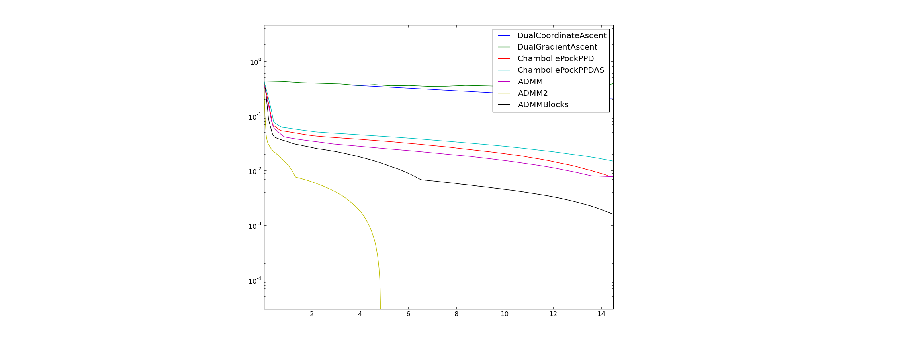

# Goal

This project provides several python codes to solve sparse linear programs of the form

The different algorithms that are implemented are documented in the [pdf](./latex/SparseLinearProgramming.pdf): 

* a dual coordinate ascent method with exact line search 
* a dual gradient ascent with exact line search
* a first order primal-dual algorithm adapted from chambolle pock [2]
* three methods based on the Alternating Direction Method of Multipliers [3]

**Note** These methods are not meant to be efficient methods to solve generic linear programs. They are simple and quite naive methods i coded while exploring different possibilities to solve sparse linear programs.

This project also provides: 

* a python class *SparseLP* (in SparseLP.py) that  makes it easier to build linear programs programs from python 
* methods to convert between the different common forms of linear programs (slack form , standard form etc), 
* methods to export the linear program to standard file formats (MPS)
* a simple constraint propagation method with back-tracking to find feasible integer values solutions (for integer programs)

# Installation

using pip

	sudo pip install git+git://github.com/martinResearch/PySparseLP.git
	

# Examples

## Image segmentation
we can use it to solve a binary image segmentation problem with Potts regularisation.

with *E* the list of indices of pairs of neighbouring pixels and *c* a cost vector that is obtain from color distribution models of the two regions.
This problem can be rewritten as a linear progam by adding an auxiliary variable *d_ij* for each edge with the constraints

 
This problem can be more efficiently solved using graph-cuts but it is still interesting to compare the different generic LP solvers on this problem. 

	from pysparselp.example1 import run
	run()

segmentation with the same random data term with the optimisations limited to 15 seconds for each method

convergence curves

Instead of using a simple Potts model we could try to solve the LP from [5]

## Sparse inverse convariance matrix 
 
The Sparse Inverse Covariance Estimation aims to find
a sparse matrix B that approximate the inverse of Covariance matrix A.

let denote f the fonction that take a matrix as an input an yield the vector of coefficient of the matrix in  row-major order.
let b=f(B) we have f(AB)=Mb with M=kron(A,I_d)
the problem rewrites

we take inspiration from this scikit-learn example [here](http://scikit-learn.org/stable/auto_examples/covariance/plot_sparse_cov.html) to generate 
samples of a gaussian with a sparse inverse covariance (precision) matrix. From the sample we compute the empirical covariance A and the we estimate a sparse inverse covariance (precision) matrix B from that empirical covariance using the LP formulation above.

	from pysparselp.example2 import run
	run()

## L1 regularised multi-class SVM

Given n examples of vector-class pairs *(x_i,y_i)*, with *x_i* a vector of size m and *y_i* an integer representing the class, we aim at estimating a matrix W of size k by m that allows to discriminate the right class, with k the number of classes. We assume that the last component of *x_i* is a one in order to represent the offset constants in W. we denote *W_k* the kth line of the matrix *W*

by adding auxiliary variables in a matrix S of the same size as the matrix W we can rewrite the absolute value as follow:

we obtain the LP formulation:

you can run the example using the following line in python

	from pysparselp.example3 import run
	run()

the support vectors are represented by black circles.

## Other example problems

we could get LP examples from  [netlib.org](http://www.netlib.org/lp/data/)
but we would need to write

* a cython wrapper for the code that decompress emps files to mps (http://www.netlib.org/lp/data/emps.c)
* a code to read MPS file in python

#TODO

* add more examples 
	* improve the  L1 SVM example by adding random feature, in order to perform feature selection  
	* add more examples for image processing, for example from [5]. 
	* add classical LP examples (maximum bipatite matching, minimum vertex cover, see https://www.cs.cmu.edu/~ckingsf/bioinfo-lectures/linearp.pdf)

* document the active-set *hack* for the chambole pock method (in ChambollePockPPDAS.py).

* finish coding the method by Conda (CondatPrimalDual.py)

* create a cython binding for LPsparse [1] using scipy.sparse matrices for the interface and adding the possibility to compute the convergence curve by providing the problem known solution to the solver.

* implement method [4]

* add simplex methods written in python, could get code from here https://bitbucket.org/jbolinge/lp
* add interior point methods (could translate in python the matlab code https://github.com/YimingYAN/pathfollow, http://www.cs.ubc.ca/~pcarbo/convexprog.html) 

# Alternatives

* Scipy's linprog. http://docs.scipy.org/doc/scipy/reference/generated/scipy.optimize.linprog.html. Only the simplex is implemented in october 2016. Note that it is possible to call this solver from within our code using *method='ScipyLinProg'* when callign the *solve* method. This method is implemented in python with many loops and is very slows for problems that involve more than a hundred variables.

* Python bindings for GLPK here https://en.wikibooks.org/wiki/GLPK/Python. Might not be adapted to very large sparse problems as it use simplex or interior point methods. The installation is a bit tedious.

# References

[1] Ian En-Hsu Yen,  Kai Zhong,  Cho-Jui Hsieh, Pradeep K Ravikumar, Inderjit S Dhillon *Sparse Linear Programming via Primal and Dual Augmented Coordinate Descent*, NIPS 2015

[2] T. Pock and A.Chambolle *Diagonal preconditioning for first order primal-dual algorithms in convex optimization*  ICCV 2011

[3]  Stephen Boyd *Distributed Optimization and Statistical Learning via the Alternating Direction Method of Multipliers*  Foundations and Trends in Machine Learning 2010

[4] Yu G Evtushenko, A I Golikov, and N Mollaverdy. *Augmented
Lagrangian method for large-scale linear programming problems*  Optimization Method and Software 2005.

[5] T. Schoenemann, F. Kahl, S. Masnou and D. Cremers *A linear framework for region-based image segmentation
and inpainting involving curvature penalization* IJCV 2012
